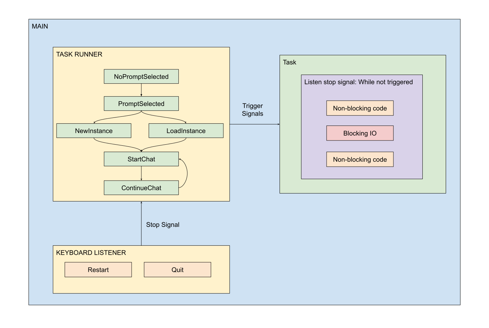

# Design and Architecture

This document lists the design and architectural decisions taken
during the development of LLM Assistant. It follows
the [Architecture Decisions](https://cognitect.com/blog/2011/11/15/documenting-architecture-decisions.html) format.

## Task Runner

**Date: (2024-07-14)**



### Context

We want to implement a command line chat session. This interface should
allow someone to:

1. select a previously written templated-prompt;
2. create instances of a prompt (by setting its template variable values);
3. load instances;
4. accept messages and return the prompt responses like in a chat.

### Decision

Create an engine to execute the states of the chat session given by a pre-defined
protocol.

The engine is the TaskRunner class and the communication protocol is the TaskInstruction class.
A TaskRunner is instantiated and we add TaskInstructions to it before calling its run method.

```python
tr = TaskRunner()
tr.add( TaskInstruction("t1", t1))
tr.add( TaskInstruction("t2", t2))
tr.run()
```

#### Remarks

- The TaskRunner runs in a single thread;
- The TaskInstruction function return itself a TaskInstruction, self-feeding the TaskRunner.
- The TaskRunner can send stop signals to a Task, for example, a blocking one. The task itself
  should handle the signal.

### Status

Done.

### Consequences

This is an independent module and it will not have consequences over the rest of the project.

### Remarks

I realized later that this solution is very similar to the event loop implemented in the
asyncio library and I might refactor this module in the future in order to use asyncio.
